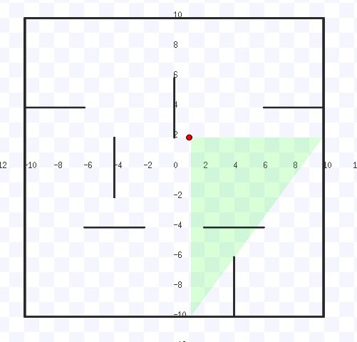

# Notes for stage ros simulator
## Stage simulator config
```
Publishes transforms:
          /base_link -> /base_laser
          /base_footprint -> /base_link (identity)
          /odom -> base_footprint
        Publishes topics:
          /odom : odometry data from the simulated odometry
          /base_scan : laser data from the simulated laser
          /base_pose_ground_truth : the ground truth pose
        Parameters:
          base_watchdog_timeout : time (s) after receiving the last command on cmd_vel before stopping the robot
        Args:
          -g : run in headless mode. if -g : no UI
```
## Usage
```
<node pkg="stage_ros" type="stageros" name="stageros" args="$(arg world_file)" respawn="true">
    <param name="base_watchdog_timeout" value="0.2"/>
  </node>
```
注意：指定了world_file
```
<arg name="world_file"     default="$(find reinforcement_learning_navigation)/maps/stage/train_env.world"/>
```

## world file config
### world
```
floorplan
(
  name "train_map"
  bitmap "../train_curriculum_1_new.png"
  size [ 20.0 20.0 2.0 ]
  pose [  0.0  0.0 0.0 0.0 ]
)
```
floorplan指定了world的大小、位置、加载的地图等
### robot
```
turtlebot
(
  pose [ 1.0 2.0 0.0 0.0 ]
  name "turtlebot"
  color "red"
	gui_nose 1
)
```
加载机器人，有初始位置等设置

## 关于laser显示问题
```
sensor( 			
    # laser-specific properties
    range [ 0.0  60.0 ]
    fov 180.0
    samples 3
  )
```
```
header: 
  seq: 3931185
  stamp: 
    secs: 393118
    nsecs: 600000000
  frame_id: "base_laser_link"
angle_min: -1.57079637051
angle_max: 1.57079637051
angle_increment: 1.57079637051
time_increment: 0.0
scan_time: 0.0
range_min: 0.0
range_max: 60.0
ranges: [11.920000076293945, 8.779999732971191, 7.909999847412109]
intensities: [1.0, 1.0, 1.0]
```


设置laser_num=3之后，最上面的laser没有显示，但是数值是正确的


## Q1:
无法得到正确的障碍物位置：
```
obstacle_positions = get_obstacle_positions(map_size, obstacles_map)
```
```
def get_obstacle_positions(map_limit, map_name):
#Load the file which contains all the obstacle positions
    return list(np.load(os.path.join(rospkg.RosPack().get_path('reinforcement_learning_navigation'),'maps', map_name+'.npy')))
```
这里直接读取了train_map.npy作为障碍物地图

## Q2: 无法设置robot的位置
调用ros的service可将机器人设置在初始位置，但是没找到任意设置的方法
```
rosservice call /reset_positions
```

## Reference
http://wiki.ros.org/stage

https://github.com/ros-gbp/stage-release

https://www.ldv.ei.tum.de/fileadmin/w00bfa/www/Vorlesungen/cpp/leistungskurs/ws1617/2015-11-17__ROS_STAGE_TF_.pdf
